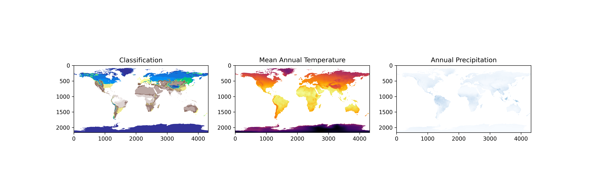
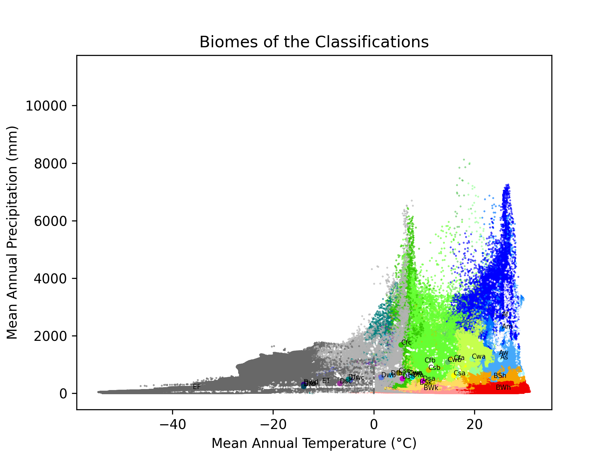
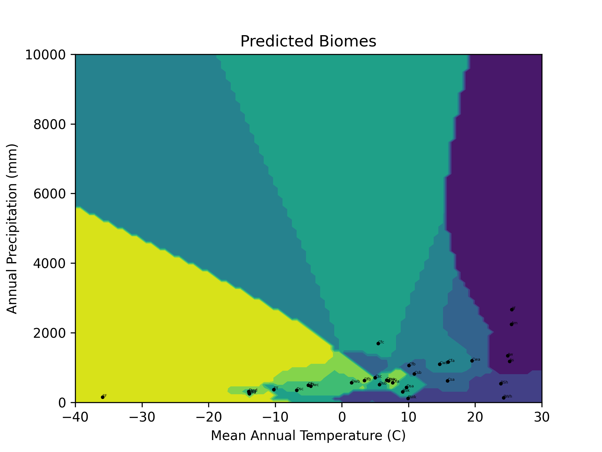

# Climate Modelling

This project aims to classify climate using a Naive Bayes approach.

The data we will use is the classified 5m data and BIO1 (Annual Mean Temperature) and BIO12 (Annual Precipitation) from the WorldClim dataset.

We will use the classified data to calculate the mean temperature and precipitation for each biome. We will then use this data to train a Naive Bayes classifier to predict the biome of a given location based on the temperature and precipitation.

The results will obviously not be perfect but it is not our goal to create a perfect classifier. We aim to create a classifier that is good enough to be used as a baseline for terrain and biome generation in games.



## The Naive Bayes Classifier

The Naive Bayes classifier is a probabilistic classifier that uses Bayes' theorem to calculate the probability of a certain observation being in a certain category based on the assumption that the observed variables are independent of each other.

More information on the Naive Bayes classifier can be found [here](https://en.wikipedia.org/wiki/Naive_Bayes_classifier).

Bayes' theorem is as follows:
$$P(A|B) = \frac{P(B|A)P(A)}{P(B)}$$

In the context of the project we can assume the following:

- The observed variables are independent of each other
- The observed variables are normally distributed
- The observed variables are continuous
- The categories are equiprobable
  
The probability that a given observation is in a certain category is calculated as follows:

- $B$ is the category (Biome) we aim to predict
- $B_i$ is the $i$th category (Biome)
- $X$ is the vector of observed variables (Temperature, Precipitation, Elevation)

$$p(X \in B | X = x) = \frac{p(X = x | X \in B) p(X \in B)}{\sum_{i=1}^{n} [p(X = x | X \in B_i) p(X \in B_i)]}$$

Because we assume that the categories are equiprobable, $X$ has a uniform distribution over the categories. Thus $P(X \in B) = \frac{1}{n}$

$$p(X \in B | X = x) = \frac{p(X = x | X \in B) \frac{1}{n}}{\sum_{i=1}^{n} [p(X = x | X \in B_i) \frac{1}{n}]}$$

$$p(X \in B | X = x) = \frac{p(X = x | X \in B)}{\sum_{i=1}^{n} [p(X = x | X \in B_i)]}$$

In words, we can say that the postulate probability that our class is $B$ for the observation $x$ is the probability of $x$ occurring in $B$ divided by the sum of $x$ occurring in all other categories.

The probability of $B$ occurring is then given by $P(B) \div \sum postulates$, but this is not a necessary step as we can simply take the max postulate. Bare in mind that this does not account for outliers.

This is implemented in python as follows:

```python
# Calculate the probability of the observation belonging to each biome
probs = data.apply(lambda row: (
    (1 / (np.sqrt(2 * np.pi) * row["MAT std"])) * 
    np.exp(-((observation.MeanAnnualTemp - row["MAT mean"]) ** 2) / (2 * row["MAT std"] ** 2)) *
    (1 / (np.sqrt(2 * np.pi) * row["AP std"])) * 
    np.exp(-((observation.MeanAnnualPrec - row["AP mean"]) ** 2) / (2 * row["AP std"] ** 2))
), axis=1)
# Normalize the probabilities
probs = probs / probs.sum()
```



## The conclusion



The Naive Bayes classifier, as the name implies, is not contextually aware. It does not take into account the spatial distribution of the biomes. It simply classifies the data points based on the probability of them belonging to a certain biome. This example also only uses two variables, temperature and precipitation. It is possible to use more variables to improve the accuracy of the classifier.

Although the classifier is not perfect, it is good enough to be used as a baseline for terrain and biome generation in games.

And it may give us insight into how these may be implemented in future.

## The Data

We once again use the WorldClim dataset. This time we use the classified 5m data and BIO1 (Annual Mean Temperature) and BIO12 (Annual Precipitation).

More information on the WorldClim dataset can be found [here](https://www.worldclim.org/data/index.html).